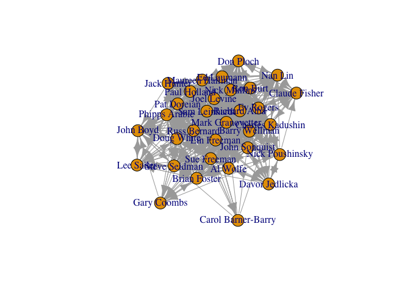
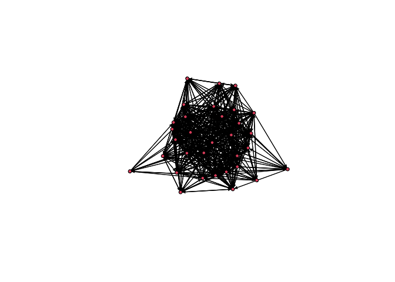

# Introducción al Análisis de Redes Sociales

Curso impartido por:

🖊 [Alejandro Espinosa-Rada](https://github.com/anespinosa)

- [](https://twitter.com/aespinosarada)
- 🏫 [Social Networks Lab](https://sn.ethz.ch), ETH Zürich

## Directorio de trabajo

``` r
setwd()
```

``` r
rm(list=ls())
```

En este workshop trabajaremos con los siguientes paquetes escritos en R:

- [classicnets](https://github.com/anespinosa/classicnets): repositorio
  con datos de redes sociales clásicas
- [igraph: The Network Analysis Package](https://r.igraph.org)
- [netmem: Network Measures using
  Matrices](https://github.com/anespinosa/netmem)
- [sna: Tools for Social Network
  Analysis](https://cran.r-project.org/web/packages/sna/index.html)
- [network: Classes for Relational
  Data](https://cran.r-project.org/web/packages/network/index.html)
- [xUCINET: Network Analysis Package for
  R](https://www.analyzingsocialnetworksusingr.com/xucinet)

## Redes

Para este tutorial se utilizan dos bases de datos. La primera fue
recolectada por Freeman y Freeman (1979, 1980) (contexto sobre la
relevancia de esta red en el desarrollo del análisis de redes en
[Freeman
2004](https://www.researchgate.net/publication/239228599_The_Development_of_Social_Network_Analysis))
y otra red más contemporánea recolectada por Rossi y Magnani (
[2018](https://arxiv.org/pdf/1501.01666.pdf))

Muchísimas gracias a [Ulrik
Brandes](https://sn.ethz.ch/profile.html?persid=239462) por proveer
parte de la información y documentación de la base de datos de EIES!

``` r
#### FREEMAN AND FREEMAN ####

## DESCARGAR LOS DATOS DESDE classicnets:
# install.packages("devtools")
# library(devtools)
# devtools::install_github("anespinosa/classicnets")
library(classicnets)
data("eies")
?eies

## DESCARGAR LOS DATOS DESDE EL PC:
load('eies.rda')

#### ROSSI AND MAGNANI ####
# install.packages("igraph")
library(igraph)

## DESCARGAR LOS DATOS DESDE EL PC:
load('gaucs.Rda')
```

Intercambio de Investigadores de Redes Sociales a través del Electronic
Information Exchange System (EIES) en Estados Unidos

Vínculos sociales:

1.  Did not know the other.
2.  Had heard of the other but had not met him/her.
3.  Had met the other.
4.  Was a friend of the other.
5.  Was a close personal friend of the other.

## Objetos Redes

Datos de redes en objeto base R:

``` r
# Atributos
as.data.frame(cbind(label = eies$label, 
                    citations = eies$citations, 
                    discipline = eies$discipline))

# Matrices
eies$time1
eies$time2
eies$messages
```

Explorando algunas propiedades generales de la matriz:

``` r
# install.packages("devtools")
# devtools::install_github("anespinosa/netmem")
library(netmem)
netmem::matrix_report(eies$time1)
```

Crear matrices desde cero:

``` r
A <- matrix(c(1,0,0,0,
         0,1,0,0,
         0,1,1,1,
         0,0,0,0,
         0,0,0,1), byrow = TRUE, ncol = 4)
B <- matrix(c(1,1,1,0,0,
              0,0,1,0,0,
              0,0,1,1,0,
              0,0,0,1,1), byrow = TRUE, ncol = 5)

netmem::matrix_report(A)
netmem::matrix_report(B)
```

Objetos tipo `igraph` considerando los Empleados del Departamento de
Ciencias de la Computación de la Universidad de Aarhus en Dinamarca:

``` r
# Lista de objetos igraph
gaucs

# Cada red por separada
gaucs$coauthor
gaucs$facebook
gaucs$leisure
gaucs$lunch
gaucs$work

# Ejercicio: Todas las redes tienen la misma cantidad de investigadores?

# Todas las redes en un mismo objeto
gaucs$`_flat_`
```

Generar un objeto `igraph` desde otros objetos en base R

``` r
# Utilizaremos EIES
igraph::graph.adjacency(eies$time1) # WARNING!

eiesT1 <- eies$time1
rownames(eiesT1) <- eies$label
colnames(eiesT1) <- rownames(eiesT1) # por qué?
matrix_report(eiesT1)

igraph::graph.adjacency(eiesT1) # WARNING!
igraph::graph.adjacency(eiesT1, weighted = TRUE)

# Agregar atributos
g1 <- igraph::graph.adjacency(eiesT1, weighted = TRUE)
V(g1)$citations <- eies$citations
V(g1)$disciplines <- eies$discipline
g1

# Visualización:
plot(igraph::graph.adjacency(eiesT1, weighted = TRUE))
```

<!-- -->

Generar un objeto `sna` desde otros objetos en base R

``` r
library(network)
network::network(eiesT1)
network::plot.network(network::network(eiesT1))
```

<!-- -->

``` r
sna <- network::network(eiesT1, multiple = TRUE)

# Agregar algunos atributos
sna %v% 'citations' <- eies$citations
sna %v% 'discipline' <- eies$discipline
sna %e% 'messages' <- eies$messages
sna
```

## Explorando los Datos

### Empleados del Departamento de Ciencias de la Computación de la Universidad de Aarhus en Dinamarca

Red no direccionada utilizando objetos tipo matriz (i.e., relación de
trabajo actual)

``` r
gaucs$work <- igraph::upgrade_graph(gaucs$work)
matrix <- igraph::get.adjacency(gaucs$work, sparse = FALSE)
dim(matrix)
head(matrix)
matrix[1,] # emisor
matrix[,1] # receptor
table(matrix[1,] == matrix[,1]) # Ejercicio: Por qué ambos son TRUE? 

ncol(matrix) # número de nodos
sum(matrix)/2 # número de vínculos

vcount(gaucs$work) == ncol(matrix)
ecount(gaucs$work) == sum(matrix)/2 # Ejercicio: Por qué la matriz se divide por dos?
```

### Intercambio de Investigadores de Redes Sociales a través del Electronic Information Exchange System (EIES) en Estados Unidos

``` r
matrix_report(eies$time1)

# Ejercicio: En cuál de los dos momentos del tiempo hay más vínculos de amistad? 
table(eies$time1) # tiempo 1
table(eies$time2) # tiempo 2

# Ejercicio: Qué tanto cambiaron los vínculos del tiempo 1 al tiempo 2? 
table(eies$time1, eies$time2)
```

Red que considera direcciones de los lazos emitidos (i.e., a quiénes
considera como amigos/as)

``` r
# Matriz de adjacencia
matrix <- ifelse(eies$time1 > 2, 1, 0)
dim(matrix)
head(matrix)
matrix[1,] # Emisor
matrix[,1] # Receptor
table(matrix[1,] == matrix[,1]) # Ejercicio: Por qué algunos son TRUE y otros FALSE? 

ncol(matrix) # número de nodos
sum(matrix) # número de aristas
matrix_report(matrix)
```

Un tipo de datos distintos! No profundizaremos sobre esto aquí. No
obstante, para explorar más, se sugiere el siguiente
[tutorial](https://anespinosa.github.io/netmem/articles/multilayer.html)
o revisar otros paquetes tales como
[multinet](https://cran.r-project.org/web/packages/multinet/index.html),
[tnet](https://toreopsahl.com/tnet/),
[xUCINET](https://sites.google.com/view/asnr-2022/xucinet?authuser=0),
[bipartite](https://github.com/biometry/bipartite) o
[migraph](https://github.com/snlab-ch/migraph)

``` r
dim(A)
rowSums(A)
colSums(A)

A %*% t(A) # Ejercicio: Qué significa esta nueva red?
t(A) %*% A # Ejercicio: Qué significa esta nueva red?
```

## Otros formatos de datos:

### Transformar los objetos redes en edgelist (lista de relaciones)

``` r
(edgelist <- netmem::matrix_to_edgelist(eiesT1, digraph = TRUE))
igraph::get.edgelist(g1)
network::as.edgelist(sna)
# Ejercicio: Qué pasa con los casos aislados? Cuáles son algunas de las diferencias entre estas funciones? Por qué en algunos casos es preferible utilizar listas de relaciones en vez de matrices?
```

### Transformar los objetos redes de lista de relaciones a objetos de redes

``` r
igraph::graph.edgelist(edgelist)
igraph::graph.data.frame(edgelist, 
                         vertices = as.data.frame(cbind(
                           label = eies$label, 
                    citations = eies$citations, 
                    discipline = eies$discipline
                    )))
network::network(edgelist)
network::network(edgelist, 
                 vertex.attr = as.data.frame(cbind(
                           label = eies$label, 
                    citations = eies$citations, 
                    discipline = eies$discipline
                    )))
```

### Transformar los objetos redes en adjacent list (lista de adyacencia)

``` r
(adjlist <- netmem::matrix_adjlist(eiesT1))
igraph::get.adjlist(g1)

# Ejercicio: En qué contexto puede ser útil utilizar listas de adyacencias?
```

Te gustaría descargar datos de Twitter, YouTube o Reddit?

- [Aquí un tutorial del libro de
  xUCINET!](https://www.analyzingsocialnetworksusingr.com/home/4-data-collection)
