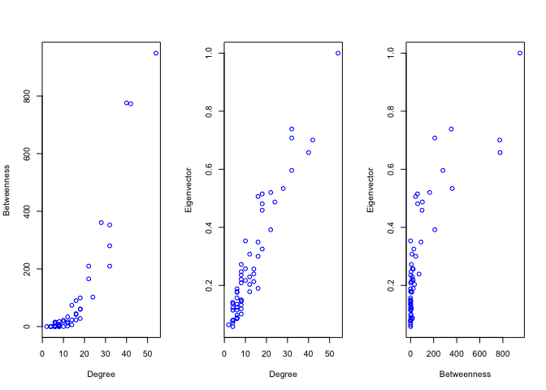

Curso impartido por:

🖊 [Alejandro Espinosa-Rada](https://github.com/anespinosa)

- [](https://twitter.com/aespinosarada)
- 🏫 [Social Networks Lab](https://sn.ethz.ch), ETH Zürich

## Directorio de trabajo

``` r
setwd()
```

``` r
rm(list=ls())
```

## Redes

Para este tutorial se utilizan dos bases de datos. La primera fue
recolectada por Freeman y Freeman (1979, 1980) (contexto sobre la
relevancia de esta red en el desarrollo del análisis de redes en
[Freeman
2004](https://www.researchgate.net/publication/239228599_The_Development_of_Social_Network_Analysis))
y otra red más contemporánea recolectada por Rossi y Magnani (
[2018](https://arxiv.org/pdf/1501.01666.pdf))

Muchísimas gracias a [Ulrik
Brandes](https://sn.ethz.ch/profile.html?persid=239462) por proveer
parte de la información y documentación de la base de datos de EIES!

``` r
#### FREEMAN AND FREEMAN ####

## DESCARGAR LOS DATOS DESDE classicnets:
# install.packages("devtools")
# library(devtools)
# devtools::install_github("anespinosa/classicnets")
library(classicnets)
data("eies")
?eies

## DESCARGAR LOS DATOS DESDE EL PC:
load('eies.rda')

#### ROSSI AND MAGNANI ####
# install.packages("igraph")
library(igraph)

## DESCARGAR LOS DATOS DESDE EL PC:
load('gaucs.Rda')
```

## Red completa

### Intercambio de Investigadores de Redes Sociales a través del Electronic Information Exchange System (EIES) en Estados Unidos

Red que considera direcciones de los lazos emitidos (i.e., a quiénes
considera como amigos/as)

``` r
# Matriz de adjacencia
matrix <- ifelse(eies$time1 > 2, 1, 0)
dim(matrix)
head(matrix)
matrix[1,] # Emisor
matrix[,1] # Receptor

ncol(matrix) # número de nodos
sum(matrix) # número de aristas

# Lista de relaciones
edgelist <- matrix_to_edgelist(matrix, digraph = TRUE)
```

Densidad

``` r
sum(matrix)/(ncol(matrix)*(ncol(matrix)-1))

library(netmem)
netmem::gen_density(matrix, directed = TRUE)

library(igraph)
g1 <- igraph::graph.adjacency(matrix, mode=c("directed"))
igraph::graph.density(g1)

library(sna)
sna1 <- network::network(matrix)
sna::gden(sna1, mode="digraph")
```

Grados de salida y grados de entrada (i.e., *outdegree* e *indegree*
centrality)

``` r
rowSums(matrix)
colSums(matrix)

igraph::degree(g1, mode = c('out'))
igraph::degree(g1, mode = c('in'))

sna::degree(sna1, gmode = "digraph", cmode = 'outdegree')
sna::degree(sna1, gmode = "digraph", cmode = 'indegree')

# Distribuciones de grados nodales
plot(table(rowSums(matrix)))
```

<!-- -->

``` r
plot(table(colSums(matrix)))
```

<!-- -->

Reciprocidad en la red

``` r
((1/2)*sum(diag(matrix%*%matrix)))/sum(matrix)
# Es la mutualidad alta en esta red?
```

Censo de díadas

``` r
netmem::dyadic_census(matrix)
igraph::dyad.census(g1) 
sna::dyad.census(sna1)
```

Censo de tríadas

``` r
igraph::triad.census(g1)
sna::triad.census(sna1)
netmem::triad_uman(matrix)
```

Coeficiente de transitividad

``` r
sna::gtrans(sna1) # weak transitivity
netmem::trans_coef(matrix)

igraph::transitivity(g1) # global transitivity
netmem::trans_coef(matrix, method = c('global'))
```

    ## Matrix is asymmetric (network is directed), the underlying graph is used

Componentes

``` r
sna::components(sna1)
sna::components(sna1, connected = 'weak')
sna::components(sna1, connected = 'strong')

igraph::components(g1)
igraph::components(g1, mode = c('weak'))
igraph::components(g1, mode = c('strong'))

netmem::components_id(matrix) # strong component!

# Ejercicio: Cuántos casos "aislados" existen si es que se consideran componentes fuertes (i.e., "strong"). Son realmente aislados?
```

Jaccard

``` r
time1 <- ifelse(eies$time1 > 2, 1, 0)
time2 <- ifelse(eies$time2 > 2, 1, 0)

netmem::jaccard(time1, time2)
```

## Ego-redes

Exploraremos las redes de algunos investigadores, tales como:

- [Linton
  Freeman](https://www.exeley.com/connections/doi/10.21307/connections-2018-003):
  sociólogo matemático que ayudó a institucionalizar la perspectiva de
  redes como un área de especialización (ejemplo: [Freeman
  2005](https://www.researchgate.net/publication/239228599_The_Development_of_Social_Network_Analysis))
  y contribuyó extensamente en el análisis de redes sociales.
- [Everett Rogers](https://en.wikipedia.org/wiki/Everett_Rogers):
  conocido por temas relacionados con *difusión de innovaciones*.
- [Nicholas
  Mullins](https://link.springer.com/content/pdf/10.1007/BF01881390.pdf):
  trabajó generando el primer modelo relacional sobre la evolución de
  *especializaciones científicas* y en la teorización relacional sobre
  la *formación de grupos*.
- [Mark
  Granovetter](https://sociology.stanford.edu/people/mark-granovetter):
  ampliamente conocido por su artículo sobre la *fuerza de los vínculos
  débiles* y en sus contribuciones en áreas relacionadas con sociología
  económica (entrevistado en el podcast bilingüe [Knitting
  Networks/Tejiendo
  Redes](https://open.spotify.com/episode/0vx0VHvUN1btyoFHcVlvNi))

``` r
set.seed(12354)
rownames(matrix) <- eies$label
colnames(matrix) <- eies$label
plot(graph.adjacency(matrix, mode = c('directed')),
     edge.arrow.size=0.3, vertex.size=5, vertex.label=NA)
```

<!-- -->

``` r
# Elegir un actor de forma aleatoria!
actor <- sample(eies$label, 1) 
ego_net(matrix, ego = actor)

# Explorando algunas redes!
plot(graph.adjacency(ego_net(matrix, ego = 'Lin Freeman'),
                  mode = c('directed')),
     edge.arrow.size=0.3,vertex.size=5,
     main = "Ego-red de Linton Freeman")
```

<!-- -->

``` r
plot(graph.adjacency(ego_net(matrix, ego = 'Ev Rogers'),
                  mode = c('directed')),
     edge.arrow.size=0.3,vertex.size=5,
     main = "Ego-red de Everett Rogers")
```

<!-- -->

``` r
plot(graph.adjacency(ego_net(matrix, ego = 'Nick Mullins'),
                  mode = c('directed')),
     edge.arrow.size=0.3,vertex.size=5,
     main = "Ego-red de Nicholas Mullins")
```

<!-- -->

``` r
plot(graph.adjacency(ego_net(matrix, ego = 'Mark Granovetter'),
                  mode = c('directed')),
     edge.arrow.size=0.3,vertex.size=5,
     main = "Ego-red de Mark Granovetter")
```

<!-- -->

Considerando la teoría de los agujeros estructurales de Ronald Burt
([1995](https://books.google.ch/books?id=E6v0cVy8hVIC&printsec=frontcover&source=gbs_ge_summary_r&cad=0#v=onepage&q&f=false)):

``` r
matrix <- get.adjacency(gaucs$work, sparse = FALSE)
egoU4 <- ego_net(matrix, ego = 'U4')
redundancy <- mean(rowSums(egoU4))
effective_size <- ncol(egoU4) - redundancy
(efficiency <- effective_size/ncol(egoU4)) # Qué tan redundante es la red de U4?
```

Para calcular constreñimiento consideraremos la implementación realizada
por Martin Everett y Steve Borgatti
([2020](https://doi.org/10.1016/j.socnet.2020.02.001))

``` r
library(netmem)
addegoU4 <- rbind(egoU4, U4=rep(1, nrow(egoU4)))
addegoU4 <- cbind(addegoU4, U4=rep(1, nrow(addegoU4)))
diag(addegoU4) <- 0
eb_constraint(addegoU4, ego="U4")

igraph::constraint(graph.adjacency(addegoU4))['U4']
```

## Nivel local del nodo

Algunas medidas de centralidad ([tabla periódica de otras
medidas](http://schochastics.net/sna/periodic.html))

``` r
g <- igraph::graph.adjacency(matrix)
deg <- igraph::degree(g)
clos <- igraph::closeness(g) # CUIDADO!
betw <- igraph::betweenness(g)
ev <- igraph::evcent(g)$vector

sort(betw, decreasing = TRUE)
sort(eigen_centrality(g)$vector, decreasing = TRUE)

op <- par(mfrow = c(1, 3))
plot(deg, betw, xlab="Degree", ylab="Betweenness", col="blue") 
plot(deg, ev, xlab="Degree", ylab="Eigenvector", col="blue") 
plot(betw, ev, xlab="Betweenness", ylab="Eigenvector", col="blue")
```

<!-- -->

``` r
cor(ev, deg)
cor(ev, betw)

set.seed(1234)
par(mfrow = c(2, 2))
layout <- layout.fruchterman.reingold(g)
plot(g,layout = layout,
     vertex.label=NA,
     edge.arrow.size=0.1,
     main="EIES")
plot(g, layout=layout, 
     vertex.label=NA,
     vertex.size=deg*0.75, 
     edge.arrow.size=0.1,
     vertex.label.cex=0.6, main="Degree Centrality")

plot(g, layout=layout,
     vertex.label=NA,
     vertex.size=betw*0.05, 
     edge.arrow.size=0.1,
     vertex.label.cex=0.6, main="Betweenness Centrality")

plot(g, layout=layout,
     vertex.label=NA,
     vertex.size=ev*20, 
     edge.arrow.size=0.1,
     vertex.label.cex=0.6, main="Eigenvector Centrality")
```

<!-- -->
